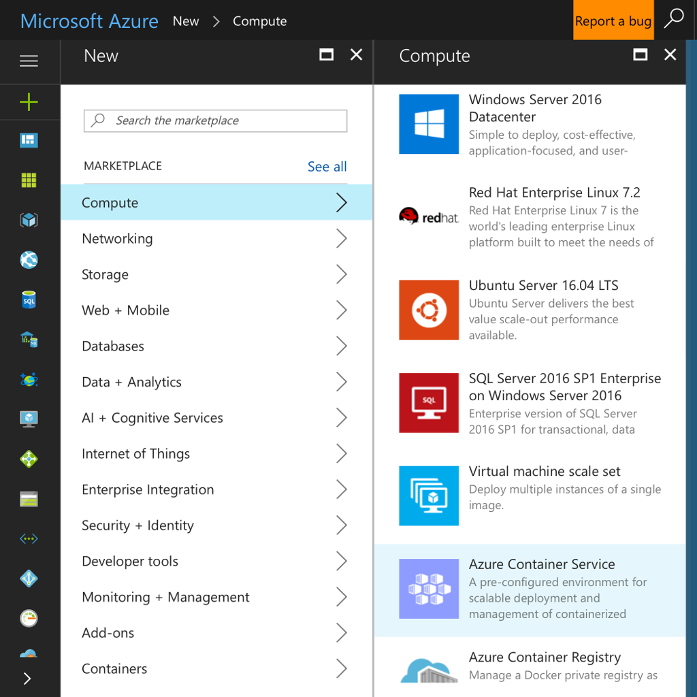
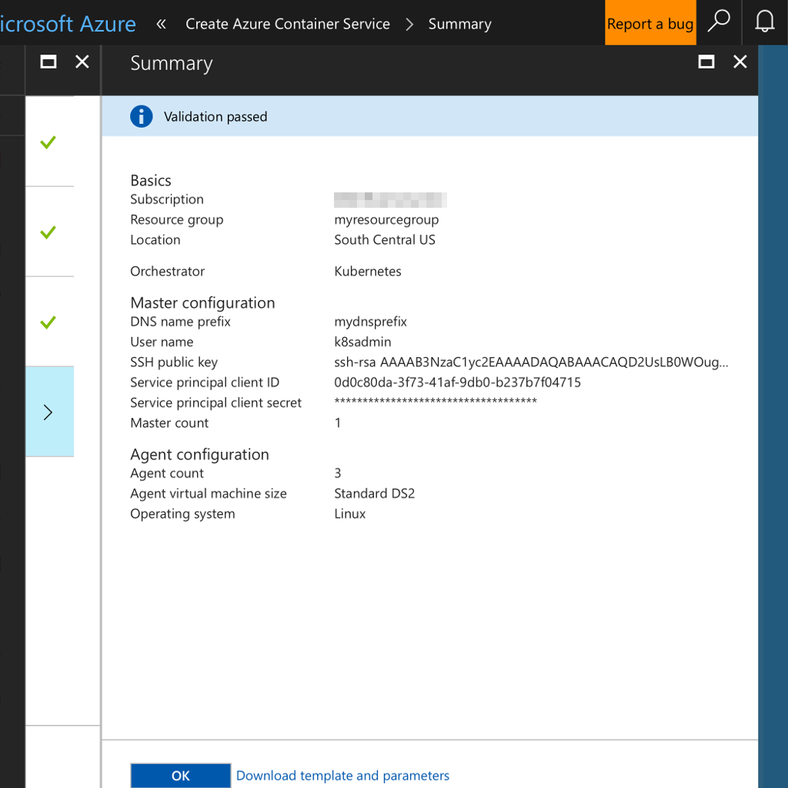

# Booting Azure Container Service

## Prerequisites

1. Azure Account - An active Azure Cloud account is required for this quick start. Start a trial with $200 of free credit [here](https://azure.microsoft.com/en-us/free/). After completing trial sign up, a credit card for billing must be added, but will not be charged.

2. Some form of *nix-based terminal - MacOS, Ubuntu, CentOS, Bash on Windows, etc
<br>Where the following is present:

3. Azure CLI - The Azure CLI (2.0) provides the `az` command which drives Azure through the command line. Install the CLI by following the instructions on [GitHub for the Azure CLI](https://github.com/Azure/azure-cli).

4. SSH Key - This is used to deploy the cluster. [This URL helps to create SSH keys compatible with Linux VMs on Azure](https://docs.microsoft.com/azure/virtual-machines/virtual-machines-linux-mac-create-ssh-keys)

## Configure the Azure CLI

After installing the CLI, log in to an Azure Account by typing `az login`. Take the code offered, enter it into the text box at [https://aka.ms/devicelogin](https://aka.ms/devicelogin), and login using an Azure account which has ownership or contributor permissions over at least one subscription.

> Note: If the Azure subscription is configured for 2FA (not done by default), the Azure account used to login must have ownership credentials to create the service principal.

```
$ az login
To sign in, use a web browser to open the page https://aka.ms/devicelogin and enter the code F7DLMNOPE to authenticate.
[
  {
    "cloudName": "AzureCloud",
    "id": "57849302-a9f0-4908-b300-31337a0fb205",
    "isDefault": true,
    "name": "Azure Subscription",
    "state": "Enabled",
    "tenantId": "591acccc-dddd-4620-8f21-dbbeeeefee21",
    "user": {
      "name": "jhansen@deis.com",
      "type": "user"
    }
  }
]
```

The `id` field from the `az login` command is the Azure Subscription Id. This id will be used throughout the guide. As a matter of convenience, set an environment variable named `SUBSCRIPTION_ID` with the value of the id (e.g. 57849302-a9f0-4908-b300-31337a0fb205). Check the configuration by setting the active subscription with `az account set`:
```
$ export SUBSCRIPTION_ID=57849302-a9f0-4908-b300-31337a0fb205
$ az account set --subscription="${SUBSCRIPTION_ID}"
```

## Create an ACS Kubernetes Cluster

Azure supports two methods to build an ACS Kubernetes cluster, through the Azure Web Portal (UI) or using the Azure command line (CLI).  Choose one of the two paths:

### Path 1: Azure 'az' CLI

Create an empty Azure resource group to hold the ACS Kubernetes cluster. The location of the resource group can be set to any available Azure datacenter. To see the possible locations run `az account list-locations --query [].name --output tsv`

Create an environment variable to hold the resource group name:

```
$ export RG_NAME=myresourcegroup
$ export DC_LOCATION=mylocation
$ az group create --name "${RG_NAME}" --location "${DC_LOCATION}"
```

Execute the command to deploy the cluster. The `dns-prefix` and `ssh-key-value` must be replaced with your own values.

```
$ export SERVICE_NAME=myacs
$ az acs create --resource-group="${RG_NAME}" --location="${DC_LOCATION}" \
  --orchestrator-type=kubernetes --master-count=1 --agent-count=2 \
  --agent-vm-size="Standard_D2_v2" \
  --admin-username="k8sadmin" \
  --name="${SERVICE_NAME}" --dns-prefix="mydnsprefix" \
  --ssh-key-value @/home/myusername/.ssh/id_rsa.pub
```

> Note: When `az acs create` starts, the provisioning process runs in the background by first creating a service principal and then waiting for AAD role to propagate.  After a few minutes the `az` command should return with information about the deployment created as shown below.

```
{
  "id": "/subscriptions/ed7cedf5-fcd8-4a5d-9980-96d838f65ab8/resourceGroups/myresourcegroup/providers/Microsoft.Resources/deployments/azurecli1481240849.890798",
  "name": "azurecli1481240849.890798",
  "properties": {
    "correlationId": "61be22d1-28d8-466c-a2ba-7bc11c2a3578",
    "debugSetting": null,
    "dependencies": [],
    "mode": "Incremental",
    "outputs": null,
    "parameters": null,
    "parametersLink": null,
    "providers": [
      {
        "id": null,
        "namespace": "Microsoft.ContainerService",
 ...
  },
  "resourceGroup": "myresourcegroup"
}
```

### Path 2: UI

Sign into the [Azure Portal](https://portal.azure.com) and create a new Azure Container Service:



Select "Resource Manager" for the deployment model:


Provide basic settings for the new ACS Kubernetes cluster.

* User name: this is the unix user name that will be added to all master and worker nodes
* SSH public key: provide a public key that will be associated with the user name specified above
* Subscription: choose the Azure Subscription that will be charged for the compute resources
* Resource group: create a new resource group and give the group a unique name
* Location: choose an Azure location for the cluster

When the required information is filled out, click "Ok".


The next step takes the Service Principal name and password generated using the Azure CLI.

* Service Principal Client ID: the name of the principal created above e.g. `http://workflow-on-acs`
* Service Principal Client Secret: the password returned by the Azure CLI e.g. 349d4728-438a-52a5-ad25-a740aa0bd240


Next, configure the number of worker nodes, the node size, and DNS prefix for the cluster.

Worker nodes should have at least 7GB of available RAM.

Click "Ok" to continue.


Review the cluster configuration and click "Ok". After clicking "Purchase" on the next screen the browser will be returned to the Azure Portal dashboard.



The Kubernetes cluster will take a few minutes to complete provisioning and configure itself. To monitor the progress of the deployment select the "Resource Group" from the nav on the left, then select the cluster name:


## Connect to the ACS Kubernetes Cluster

`kubectl` is the Kubernetes command line client.  If you don't already have it installed, you can install it with:

```console
az acs kubernetes install-cli
```

Download the master kubernetes cluster configuration to the ~/.kube/config file by running the following command:

```console
az acs kubernetes get-credentials --resource-group=$RG_NAME --name=$SERVICE_NAME
```

Verify connectivity to the new ACS Kubernetes cluster by running `kubectl cluster-info`

```
$ kubectl cluster-info
Kubernetes master is running at https://mydnsprefix.myregion.cloudapp.azure.com
Heapster is running at https://mydnsprefix.myregion.cloudapp.azure.com/api/v1/proxy/namespaces/kube-system/services/heapster
KubeDNS is running at https://mydnsprefix.myregion.cloudapp.azure.com/api/v1/proxy/namespaces/kube-system/services/kube-dns
kubernetes-dashboard is running at https://mydnsprefix.myregion.cloudapp.azure.com/api/v1/proxy/namespaces/kube-system/services/kubernetes-dashboard
```

You are now ready to [install Deis Workflow](install-azure-acs.md)
